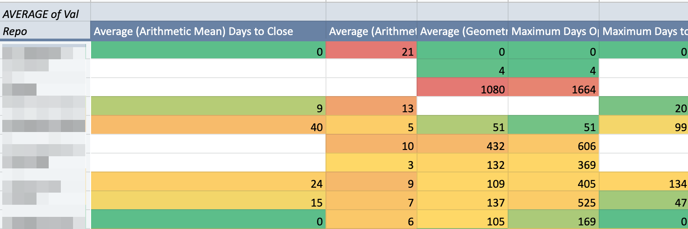

# PR stats in google sheets #

This hacky little project can be used to generate a nice looking table that shows how long PRs stay open in your organization on a repo by repo basis.

The heavy lifting is done by the https://github.com/rvesse/gh-pr-stats project.

This is what you will get:



Here's how to make it work:

1. Clone this project
1. Clone https://github.com/rvesse/gh-pr-stats and put pr-stats in your PATH (one way is ``` export PATH="$PATH:/path/to/gh-pr-stats" ```)
1. Follow the instructions in https://github.com/rvesse/gh-pr-stats to setup tokens. 
1. ``` export GH_USER="yourusername" ```
1. ``` export GH_TOKEN="yourtoken" ```
1. ./get_stats.sh ORGANIZATION -o /tmp/pr-stats # Where ORGANIZATION is your GitHub organization name.  This should generate one txt file per repo in /tmp/pr-stats.
1. ./make_tsv.sh /tmp/pr-stats > /tmp/pr-stats.tsv
1. Create a copy of this <a href="">Google sheet</a>
1. Switch to the "source data" sheet.  File -> Import -> choose the /tmp/pr-stats.tsv file and replace the data.
1. The Pivot table on the first sheet should now contain summary stats of the services in your organization.  
